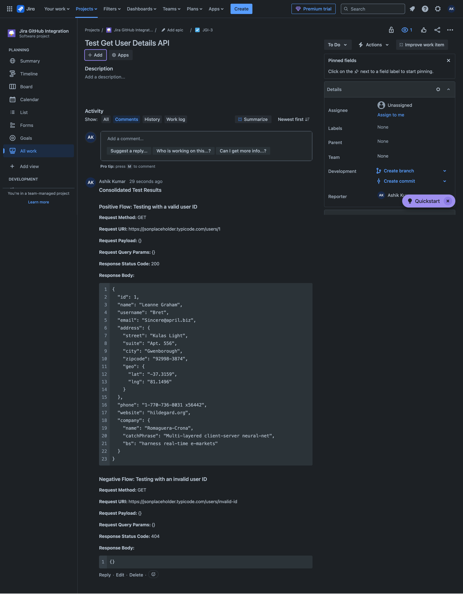

# Postman-Jira Automation: Streamlined Test Reporting

## Table of Contents
- [Overview](#overview)
- [Key Features](#key-features)
- [Repository Structure](#repository-structure)
- [Prerequisites](#prerequisites)
- [Setup Instructions](#setup-instructions)
  - [Step 1: Clone This Repository](#step-1-clone-this-repository)
  - [Step 2: Import Postman Collection and Environment](#step-2-import-postman-collection-and-environment)
  - [Step 3: Run the Collection](#step-3-run-the-collection)
- [Placeholder Variables](#placeholder-variables)
- [Example Workflow](#example-workflow)
  - [Example Jira Comment Output](#example-jira-comment-output)
- [Troubleshooting](#troubleshooting)
  - [Tips](#tips)
- [Related Resources](#related-resources)
- [Contributing](#contributing)
- [License](#license)

---

## Overview

This repository demonstrates a **Proof of Concept (POC)** for integrating **Postman** with **Jira** to automate the posting of test results as comments on Jira tickets. This integration reduces manual effort and improves team efficiency by consolidating test results and directly adding them to the relevant Jira tickets.

---

## Key Features

- **Automated Comments**: Consolidates test results and formats them as Jira comments.
- **Detailed Request/Response Information**: Includes Request Method, URI, Payload, Query Params, Status Code, and Response Body in the comments.
- **Rich Text Formatting**: Headings, bold text, and JSON-formatted response bodies for readability.
- **Duplicate Removal**: Ensures no test scenarios are repeated in comments.
- **Extensible**: 
  - Easily customizable to add more test cases or scenarios.
  - Supports adding additional automation workflows for Jira tasks.

---

## Repository Structure

```plaintext
postman-jira-automation/
├── assets/                         # Contains static assets (e.g., images, screenshots)
│   └── example-jira-comment.png    # Example of a Jira comment for the workflow
├── postman/                # Postman collection and environment configuration
│   ├── collection.json     # Postman collection
│   ├── environment.json    # Postman environment variables with placeholders
├── scripts/                            # Pre-request and test scripts for Postman
│   ├── collection_pre_request.js       # Clears variables before running the collection
│   ├── final_request_pre_request.js    # Posts consolidated test results to Jira
│   └── request_test_script.js          # Captures test results dynamically
├── LICENSE     # License file for the project
└── README.md   # Project documentation
```

---

## Prerequisites

Before you begin, ensure you have the following:

1. **Postman** installed ([Download here](https://www.postman.com/downloads/)).
2. A **Jira account** with API access.
3. A **Jira API Token** ([Generate it here](https://id.atlassian.com/manage/api-tokens)).
4. Basic knowledge of Postman collections.

---

## Setup Instructions

### Step 1: Clone This Repository

Clone the repository to your local machine:

```bash
git clone https://github.com/ashikkumar23/postman-jira-automation.git
cd postman-jira-automation
```

---

### Step 2: Import Postman Collection and Environment

1. **Import the Postman Collection**:
   - Open Postman and import the `collection.json` file from the `postman/` directory.

2. **Import the Postman Environment**:
   - Open Postman and import the `environment.json` file from the `postman/` directory.

3. **Update the Environment Variables**:
   - Replace placeholders (e.g., `{{replace_with_your_encoded_jira_auth_token}}`) with appropriate values.

4. **Verify All Variables**:
   - Ensure placeholders are replaced with the correct values before running the collection.

---

### Step 3: Run the Collection

1. Open the Postman **Collection Runner**.
2. Select the imported collection and the environment you configured.
3. Click **Run** to execute the requests.

---

## Placeholder Variables

| Variable        | Scope         | Description                                     | Example                                   | Default Value      |
|-----------------|---------------|-------------------------------------------------|-------------------------------------------|--------------------|
| `baseUrl`       | Collection    | Base URL of the API being tested                | `https://jsonplaceholder.typicode.com`    | None               |
| `testResults`   | Collection    | Stores test results dynamically during the run  | `[]`                                      | `[]`               |
| `jiraBaseUrl`   | Environment   | Jira instance URL                               | `https://your-domain.atlassian.net`       | Must be configured |
| `jiraAuth`      | Environment   | Jira API token encoded in Base64                | `Basic dXNlcm5hbWU6YXBpdG9rZW4=`           | Must be configured |
| `jiraIssueKey`  | Environment   | Jira issue key where test results will be posted | `JGI-3`                                   | Must be configured |

---

## Example Workflow

### Example Jira Comment Output

Below is an example of how a consolidated test report appears as a Jira comment after running the Postman collection:



---

## Troubleshooting

### Common Issues

1. **"INVALID_INPUT" Error**:
   - Ensure the Jira payload follows the strict `doc` format.
   - Check the Postman Console for debugging logs.

2. **Empty `testResults` Variable**:
   - Confirm the `collection_pre_request.js` script runs only at the start of the collection.

3. **Authorization Errors**:
   - Verify the `jiraAuth` variable contains the correct Base64-encoded token.

4. **Environment Variables Not Resolving**:
   - Ensure the correct environment is selected in Postman before running the collection.

### Tips
- Use the Postman Console to debug issues (available under View → Show Postman Console).
- Ensure your Jira API token has the necessary permissions to post comments.

---

## Related Resources

- [Using Postman Environments](https://learning.postman.com/docs/sending-requests/managing-environments/)
- [Jira REST API Documentation](https://developer.atlassian.com/cloud/jira/platform/rest/v3/)
- [What is Base64 encoding?](https://www.base64-image.de/)

---

## Contributing

Feel free to open issues or submit pull requests to enhance this POC. Suggestions for additional features or bug fixes are welcome!

---

## License

This project is licensed under the [MIT License](https://github.com/ashikkumar23/postman-jira-automation/blob/master/LICENSE).